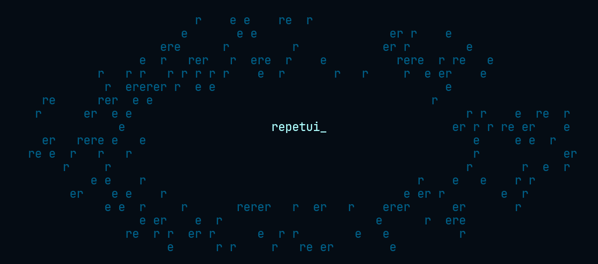
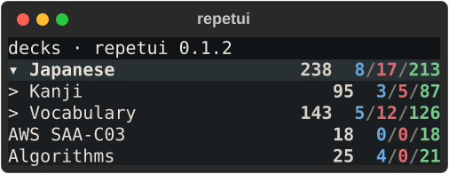
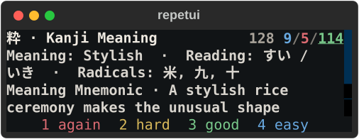

# repetui

<p align="center">
  
</p>

<p align="center"><strong>Anki review, built for small terminal panes.</strong></p>

`repetui` is an unofficial, keyboard-first TUI for reviewing an existing Anki
collection. It keeps deck context, due counts, and review actions useful at
roughly 40 columns by 6 rows—small enough to live beside your work.

<p align="center">
  
  
</p>

<p align="center"><sub>Real app captures at 40×6 using disposable demo data.</sub></p>

## Quick start

Anki Desktop must already be installed and synchronized with AnkiWeb at least
once. Close Anki Desktop before starting `repetui`; both applications use the
same local collection and must not run against it together.

```bash
uv tool install git+https://github.com/wh1skr/repetui
repetui
```

If you have more than one Anki profile:

```bash
repetui --profile PROFILE_NAME
```

## Controls

| Where | Keys | Action |
| --- | --- | --- |
| Decks | `j` / `k` | Move |
| Decks | `Enter` | Review selected deck |
| Decks | `Tab` | Expand or collapse |
| Review | `Enter` | Reveal, then answer Good |
| Review | `1`–`4` | Again, Hard, Good, Easy |
| Review | `j` / `k`, `g` / `G` | Scroll; jump to top or bottom |
| Review | `Space` | Open or close the selected folded section |
| Review | `u`, `b`, `x`, `f` | Undo, bury, suspend, flag |
| Decks / review | `s` | Sync with AnkiWeb |
| Anywhere | `?` | Help, controls, and section settings |
| Anywhere | `q` | Quit |

Navigation remains fixed so it is always recoverable. Review actions can be
rebound under `?` → Controls; conflicts are shown before an existing action is
unbound.

## Card rendering

Anki cards are HTML documents designed for a browser. `repetui` translates
their rendered content into terminal-native text while preserving ordered text,
headings, ruby readings, lists, tables, code, math labels, and media references
where possible. Unknown markup falls back to its visible text rather than being
silently discarded.

Template JavaScript, typed-answer grading, CSS layout, and media playback are
not currently executed. Card creation, editing, and statistics are also outside
the current scope.

### Acknowledgements

Early development of repetui drew on [Clanki's](https://github.com/alvenw/clanki)
approach to interfacing with Anki's backend systems. Thank you to Alven Wang and
the Clanki contributors for their work.

## Licence and relationship to Anki

repetui is an independent, unofficial project and is not affiliated with or
endorsed by Ankitects. It uses Anki's AGPL-licensed backend and is distributed
under [AGPL-3.0-or-later](LICENSE). See [NOTICE](NOTICE) for third-party
attribution.
