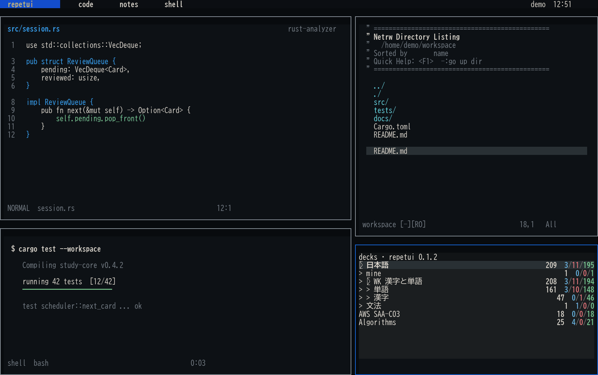
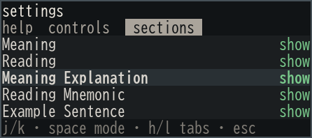
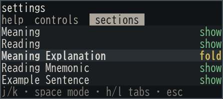
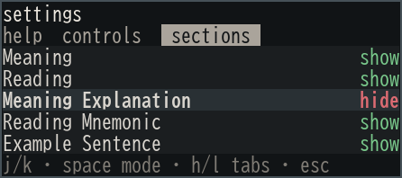

# repetui

<p align="center">
  
</p>

<p align="center"><strong>Anki review, built for small terminal panes.</strong></p>

`repetui` is an unofficial, keyboard-first TUI for reviewing an existing Anki
collection. It keeps deck context, due counts, and review actions useful at
roughly 40 columns by 6 rows—small enough to live beside your work.

<p align="center">
  
</p>

<p align="center"><sub>Mock workspace and card data; the Repetui pane is rendered by the real app at 63×13.</sub></p>

## Quick start

Anki Desktop must already be installed and synchronized with AnkiWeb at least
once. Close Anki Desktop before starting `repetui`; both applications use the
same local collection and must not run against it together.

```bash
uv tool install git+https://github.com/wh1skr/repetui
repetui
```

If you have more than one Anki profile:

```bash
repetui --profile PROFILE_NAME
```

### Collection already in use

The startup recovery screen offers `r` to retry after manual closure and `c`
to request closure of the verified instance holding this collection. On
Linux/WSL, recent Repetui instances can exit cooperatively; an instance currently
syncing will not exit on that request. Waiting is bounded and Escape cancels
waiting (it cannot undo a close request already sent).

If orderly closure is unavailable or times out, `f` shows a separate warning
naming the owner. Type `FORCE` to terminate it and retry. This may interrupt
writes or lose unsaved work. No termination occurs without confirmation, and
the process identity and collection lock are checked again before signaling.

Only verified, same-user Linux Anki/Repetui owners can be targeted. Anki Desktop
does not currently support cooperative closure here; older Repetui instances
also require manual closure or the separate force option. Windows-host/macOS,
unknown owners, inaccessible locks, and unsupported process APIs use manual
Retry. Recovery never deletes collection, lock, WAL, or journal files.

## Controls

| Where | Keys | Action |
| --- | --- | --- |
| Decks | `j` / `k` | Move |
| Decks | `Enter` | Review selected deck |
| Decks | `Tab` | Expand or collapse |
| Review | `Enter` | Reveal, then answer Good |
| Review | `1`–`4` | Again, Hard, Good, Easy |
| Review | `j` / `k`, `g` / `G` | Scroll; jump to top or bottom |
| Review | `Space` | Open or close the selected folded section |
| Review | `r` | Toggle bracketed readings directly on the card |
| Review | `u`, `b`, `x`, `f` | Undo, bury, suspend, flag |
| Card-field setup | `Space`, `J` / `K`, `a`, `p`, `v`, `Enter` | Change role, reorder, suggest a layout, preview, flip question/answer, save |
| Decks / review | `s` | Sync with AnkiWeb |
| Anywhere | `?` | Help, controls, and section settings |
| Anywhere | `q` | Quit |

Navigation remains fixed so it is always recoverable. Review actions can be
rebound under `?` → Controls; conflicts are shown before an existing action is
unbound. The same tab offers a profile-scoped **Action feedback duration**:
Instant, Brief, Normal, or Relaxed. This controls successful Undo, Bury,
Suspend, and Flag confirmations; errors remain readable. While a successful
confirmation is visible, `Enter` dismisses it and immediately continues with
the current card's primary action, while `Escape` only dismisses it.

### Full-sync conflicts

If sync reports **full sync required**, your cards have not been synchronized.
Press `d` to download AnkiWeb into this local collection, or `u` to upload this
local collection to AnkiWeb. A separate confirmation shows the active profile
and replacement risk; type `DOWNLOAD` or `UPLOAD` exactly and press Enter.
Nothing is selected by default. Escape cancels without transferring data.

Every confirmed attempt first exports and checks a local `.colpkg` backup in
`backups/repetui-full-sync-*/` beside the collection. Backup failure blocks the
transfer. These backups contain collection data, not media, and are retained
for recovery through Anki Desktop. They do **not** preserve web-only changes:
before uploading, back up any progress on your other clients separately.

Full sync replaces, rather than merges, one collection. If both sides have
unsynced progress, preserve and reconcile it before choosing either direction.
Windows and WSL may use separate collections; check the selected profile.
Use arrow keys to scroll instructions in small panes. After a failed attempt,
Esc/Enter returns to study; press `s` to retry and make a fresh choice.

## Card rendering

Anki cards are HTML documents designed for a browser. `repetui` translates
their rendered content into terminal-native text while preserving ordered text,
headings, lists, tables, code, math labels, and media references where possible.
Ruby and Japanese `漢字[かんじ]` readings stay attached to their base text instead
of appearing after every kanji by default. Press `r` during review to show
them inline as `漢字[かんじ]`; press `r` again to hide them. Only visible card
content is annotated—unrevealed or hidden answers stay hidden. Unknown markup
falls back to its visible text rather than being silently discarded.

If a script-heavy template cannot be separated safely, `repetui` derives a
field-based terminal layout and opens a one-time setup. Assign fields to Prompt,
Answer, Auto, or Ignore with `Space`, reorder them with `J` / `K`, and save with
`Enter`. The live preview updates before you save: `v` flips between question
and answer, and `p` swaps between fields and preview in a narrow terminal.
Widen the terminal to see both side by side. `Escape` discards unsaved edits.
Press `a` to suggest a layout from several cards of the same template. A
high-confidence suggestion changes only the draft; `Enter` is still required
to save it. If the cards are too ambiguous, the current draft is kept for
manual editing. Suggestions inspect Anki's rendered sides and source fields;
they do not execute card JavaScript or promise to understand every card type.
Repeated instructions may be left on Auto, and separately styled prompt and
answer fields are kept distinct when the rendered sides support that choice.
The field-based view preserves underlines from `<u>`, inline text decoration,
and simple underlined class rules in the card stylesheet. Other card-template
CSS and JavaScript hover effects are not reproduced; check the live preview
before saving.
Auto fields appear only when that field's content is present on the
rendered card, so optional fields can start being used later without another
setup. The mapping is remembered per note type and card template and can be
edited under `?` → `Sections` → `card fields`. This adapts complex card types
without executing their JavaScript or adding template-specific code. The same
editor is available for any active card with usable source fields, so an
unrecognized template can still be configured manually.

## Sections that fit your pane

Card backs are not equally useful at every size. During review, open
`?` → `Sections` and choose how each detected section should behave for that
card template.

| Show | Fold | Hide |
| :---: | :---: | :---: |
|  |  |  |
| Keep the full section in the answer. | Keep a one-line section you can open with `Space`. | Leave the section out of review. |

Choices are remembered per note type and card template, so long explanations
and mnemonics can stay one keypress away without taking over every card.

Template JavaScript, typed-answer grading, CSS layout, and media playback are
not executed. Card creation, editing, and statistics are also outside the
current scope.

### Acknowledgements

Early development of repetui drew on [Clanki's](https://github.com/alvenw/clanki)
approach to interfacing with Anki's backend systems. Thank you to Alven Wang and
the Clanki contributors for their work.

## Licence and relationship to Anki

repetui is an independent, unofficial project and is not affiliated with or
endorsed by Ankitects. It uses Anki's AGPL-licensed backend and is distributed
under [AGPL-3.0-or-later](LICENSE). See [NOTICE](NOTICE) for third-party
attribution.
